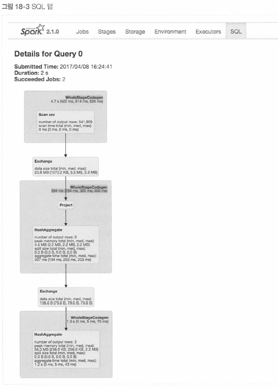
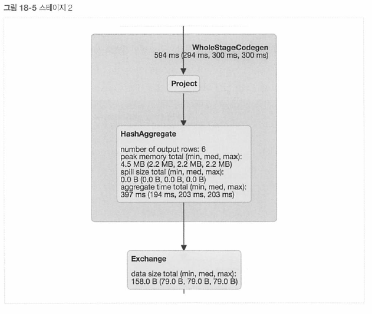

# 17장. 스파크 배포 환경
- 스파크 애플리케이션 실행에 필요한 인프라 구조
+ 클러스터 배포 시 선택사항
+ 스파크가 지원하는 클러스터 매니저
+ 배포 시 고려사항과 배포 환경 설정
- 스파크 지원 클러스터 매니저는 유사하지만, 다양한 클러스터 구성 방법이 있음 -> 근본적인 차이점에 대해 설명
- 스파크가 지원하는 클러스터 매니저
+ 스탠드얼론 모드
	+ 스파크에 패키지 되어있는 클러스터 관리자, 가장 간단함
	+ 동적으로 자원 사용량 조절이 되지 않음, 여러 애플리케이션 동시 사용 X
+ 하둡 YARN
	+ 하둡에서 사용할 수 있는 클러스터 관리자, 장시간 실행되는 배치 작업에 최적화
	+ 자원 초과 사용할 경우 얀이 터져요!
+ 아파치 메소스(Mesos)
	+ 짧게 실행되고 없어지는 워크로드에 적합
	+ cluster configuration이 Yarn보다 유연하지 못함
[Remarks](https://blog.naver.com/chemicalatom/220886863538)

## 17.1 스파크 애플리케이션 실행을 위한 클러스터 환경
+ 설치형 클러스터
+ 공개 클라우드

### 17.1.1 설치형 클러스터 배포 환경
- 자체 데이터센터를 운영하는 조직에 적합 (Zeppelin)
- 설치형 클러스터 환경은 사용 중인 하드웨어를 완전히 제어할 수 있음 -> 워크로드의 성능을 최적화
+ 설치형 클러스터의 문제점
	+ 크기가 제한적, 자원에 따라 적당한 클러스터의 크기를 설정해야 함
	+ HDFS나 분산 키-값 저장소 같은 자체 저장소 시스템을 운영해야 함
	+ 상황에 따라 지리적 복제 및 재해 복구 체계 구축
+ 문제점 1 - 자원 활용 문제 해결 방법은 클러스터 매니저 사용
	+ 클러스터 매니저 사용 시 다수의 스파크 애플리케이션 실행 가능
	+ 애플리케이션 자원 동적 재할당 가능
	+ 동시에 여러 애플리케이션 실행 가능
		+ 동적 자원 공유 : YARN, 메소스 > 스탠드얼론 모드
	+ 자원 공유를 제어하는 것이 가장 큰 차이점
		+ 공개 클라우드는 애플리케이션에 맞는 규모의 클러스터를 할당해줌
+ 문제점 2, 3 - 저장소 시스템 사용으로 해결
	+ 하둡의 HDFS (분산 파일 시스템), 아파치 카산드라 (키-값 저장소 시스템) 주로 사용

### 17.1.2. 클라우드 배포 환경
- 설치형 클러스터 -> 클라우드 환경으로 진화
+ 클라우드 배포 환경의 장점 - 유연성
	+ 자원을 탄력적으로 늘이고 줄이는 것이 가능
		+ 막 써도 사용한 만큼 비용 지불하면 끝 ^^
		+ 딥러닝이 필요할 때만 GPU 인스턴스 할당받아 쓸 수 있음 (Jutopia)
	+ 공개 클라우드 환경은 비용이 저렴 + 지리적 복제 기능 지원함 -> 대규모 데이터 쉽게 관리
	+ 환경 관리를 따로 하지 않아도 됨
- AWS, Microsoft Azure, GCP
- 고정된 크기의 클러스터와 파일 시스템은 클라우드와 같은 유연한 시스템과 맞지 않음
	- 파일 시스템도 Amazon - S3, Azure Blob, Google Cloud와 같이 분리된 저장소 시스템을 사용해야 함
	- 스파크 워크로드마다 별도의 클러스터를 동적으로 할당해야 함
- 데이터브릭스에서 무료로 클라우드 배포 환경을 사용할 수 있음

## 17.2 클러스터 매니저

### 17.2.1 스탠드얼론 모드
- 스파크 워크로드용으로 특별히 제작된 경량화 플랫폼
- 간단하고 빠르게 환경을 구축, 스파크 어플리케이션만 사용하는 시스템에 적합

#### 스탠드얼론 클러스터 시작하기
[Remarks](https://opennote46.tistory.com/238)
마스터 프로세스 실행
``` C
$SPARK_HOME/sbin/start-master.sh 
```
- spark://HOST:PORT를 통해 마스터 웹 UI 확인 가능
워커노드 프로세스 실행 (슬레이브 구동)
``` C
$SPARK_HOME/sbin/start-slave.sh
```
- 시작 스크립트에 두 명령어를 설정하여 스탠드얼론 클러스터 시작 자동화 가능
- conf/slaves 파일을 생성하여, 스파크 워커로 사용할 모든 머신의 호스트명을 기록해야 함 -> 안할 경우, 모두 로컬에서 실행됨
```C
$SPARK_HOME/sbin/start-all.sh # 마스터 + 모든 슬레이브 구동
$SPARK_HOME/sbin/stop-master.sh # 마스터 중지
$SPARK_HOME/sbin/stop-slaves.sh # 슬레이브 중지
$SPARK_HOME/sbin/stop-master.sh # 마스터 + 슬레이브 중지
```
- 스탠드얼론 클러스터 설정은 [여기](http://bit.ly/2xg4FEN)
	- 포트, 메모리, 자바옵션, Core, Class path 설정 가능
	- SPARK_WORKER_MEMORY, SPARK_WORKER_CORES

### 17.2.2 YARN
- 잡 스케줄링과 클러스터 자원 관리용 프레임워크
- 하둡과 스파크는 독립적임!
- 스탠드얼론 모드에 비해 더 많은 기능 사용 가능

#### 어플리케이션 제출하기
마스터 인수 값을 yarn으로 지정해야 함 --master yarn
- yarn cluster mode
	- 스파크 드라이버 프로세스를 관리
- yarn client mode
	- 마스터 노드를 관리하지 않고 애플리케이션에 익스큐터 자원을 배분
+ yarn 속성을 이용하여 우선순위 큐와 보안에 필요한 keytab 파일 제어 가능

### 17.2.3 YARN 환경의 스파크 어플리케이션 설정하기

#### 하둡 설정
/etc/hadoop/conf 하위에 설정 파일 존재
- hdfs-site.xml : HDFS 클라이언트 동작 방식 설정
- core-site.xml : 기본 파일 시스템의 이름을 설정

#### YARN 속성
- resource, memory, core, waitTime, jar file, queue 설정 가능 [여기](http://spark.apache.org/docs/latest/running-on-yarn.html#configuration)
	- spark.yarn.queue
	- spark.yarn.keytab
	- spark.yarn.am.cores

### 17.2.4 메소스에서 스파크 실행하기
- CPU, 메모리, 저장소, 다른 연산 자원을 머신에서 추상화
- 탄력적 분산 시스템 구성 -> 효과적으로 실행
- 웹 어플리케이션이나 다른 자원 인터페이스 등 오래 실행되는 어플리케이션까지 관리할 수 있는 데이터센터 규모의 클러스터 매니저
- 가장 무거워서 환경이 잘 구축되어 있는 경우 사용
+ 두 가지 메소스 모드
	+ fine-grained mode
	+ coarse-grained mode : 현재는 이것만 지원
		+ 스파크 익스큐터를 단일 메소스 태스크로 실행
		+ spark.executor.memory, spark.executor.cores 등으로 크기 조절

#### 어플리케이션 제출하기
- cluster 모드 방식이 가장 좋음
``` C
export MESOS_NATIVE_JAVA_LIBRARY=<libmesos.so 파일의 경로>
export SPARK_EXECUTOR_URI=<업로드한 spark-2.2.0.tar.gz 파일의 URL>
```
```scala
import org.apache.spark.sql.SparkSession
val Spark = SparkSession.builder
.master("mesos://HOST:5050")
.appName("my app")
.config("spark.executor.uri", "<업로드한 spark-2.2.0.tar.gz 파일의 URL>") .getOrCreate()
```

#### 메소스 설정하기
- core, volumn, memoryOverhead [여기](http://bit.ly/2DPmLTf)
	- spark.mesos.extra.cores
	- spark.mesos.mesosExecutor.cores

### 17.2.5 보안 관련 설정
- 신뢰도가 낮은 환경에서 안전하게 실행될 수 있도록 저수준 API 기능 제공
+ 통신 방식과 관련이 깊음
	+ 인증, 네트워크 구간 암호화
	+ TLS, SSL 설정

### 17.2.6 클러스터 네트워크 설정
- proxy 사용 등 네트워크 설정
	- 주소값, 대기 시간, Retry 횟수, Timeout

### 17.2.7 어플리케이션 스케줄링
- 독립적인 익스큐터 프로세스 실행
	- 클러스터 매니저가 스파크 어플리케이션 전체에 대한 스케줄링
- 여러 개의 잡을 다른 스레드가 제출한 경우 동시에 실행 가능
	- 페어 스케줄러 기능을 제공함 : 공정하게 실행 중인 모든 잡에 자원을 동적 분배
	- 가장 간단한 방법이 자원을 고정된 크기로 나눔 -> 어플리케이션 종료 전까지 해당 자원 점유

#### 동적 할당
- 하나의 클러스터에 여러 스파크 어플리케이션을 실행하기 위해서 어플리케이션이 점유하는 자원을 동적 할당해야 함
	- spark.dynamicAllocation.enabled = true로 지정
	- spark.shuffle.service.enabled = true로 지정

## 17.3 기타 고려사항
- 어플리케이션의 개수와 유형
	- YARN은 HDFS를 사용하는 어플리케이션을 실행할 때 적합 -> 이외에는 별로
		- 클라우드 환경을 지원하지 않음
		- 클러스터를 확장할 때 연산용, 저장소 클러스터 모두 확장해야 함
	- 메소스 : 다양한 어플리케이션 유형을 지원하지만, 더 큰 규모의 클러스터에 적합
		- 고작 스파크 어플리케이션만 실행하려면 오버스펙이다.
- 스파크 버전 관리, 디버깅 로그 기록 방식 설정, 메타스토어 사용, 외부 셔플 서비스 사용, 모니터링 솔루션 설정

# 18. 모니터링과 디버깅
## 18.1 모니터링 범위
- 오류 발생을 위한 스파크 잡 모니터링
	- 스파크 어플리케이션과 잡
		- 스파크 UI와 스파크 로그 확인
		- RDD와 쿼리 실행 계획 확인
	- JVM
		- 스파크는 모든 익스큐터를 개별 자바 가상 머신(JVM)에서 실행함
			- 각 가상 머신을 모니터링해야 함
		- JVM 도구 [여기](https://soft.plusblog.co.kr/51) [stack과 heap](https://yaboong.github.io/java/2018/05/26/java-memory-management/)
			- stack trace를 제공하는 jstack : thread dump 생성하여 프로세스 현황을 볼 수 있음
			- heap dump를 생성하는 jmap : 메모리 사용현황을 볼 수 있음, 메모리 관리
			- 시계열 통계 리포트를 제공하는 jstat
			- JVM 속성 변수를 시각화하는 jconsole
			- 스파크 잡의 동작 특성을 알 수 있는 jvisualvm
	- OS와 머신
		- 머신의 상태를 모니터링해 정상 작동 중인지 확인해야 함
		- dstat, iostat, iotop 명령 사용하여 모니터링
	- 클러스터
		- 스파크 어플리케이션이 실행되는 클러스터도 모니터링해야 함


## 18.2 모니터링 대상
- 실행 중인 사용자 어플리케이션의 프로세스 (CPU, 메모리 사용률 등)
- 프로세스 내부에서의 쿼리 실행 과정 (잡과 태스크)

- 드라이버와 익스큐터 프로세스
	- 스파크 어플리케이션을 모니터링할 때는 스파크 드라이버를 잘 보면 됨
- 쿼리, 잡, 스테이지, 테스크

## 18.3 스파크 로그
- 스파크 로그와 어플리케이션 로그 모두 확인 가능
- 스파크 로그 수준 변경
```python
spark.sparkContext.setLogLevel("INFO")
```
- 클러스터 매니저로 파일에 로그 저장 가능
- 디버깅하려면 로그 파일이 꼭 필요함, 이미 어플리케이션은 비정상 종료되었기 때문

## 18.4 스파크 UI
- 보통은 기본 4040포트
+ Tab
	+ Jobs : 스파크 잡
	+ Stages : 개별 스테이지 (스테이지의 태스크)
	+ Storage : 스파크 어플리케이션에 캐싱된 정보, 데이터 정보
	+ Environment : 스파크 어플리케이션 구성과 설정 관련 정보
	+ Executors : 어플리케이션에서 사용 중인 익스큐터의 상세 정보
	+ SQL : SQL과 DataFrame을 포함한 구조적 API 쿼리 정보 제공
	+ Job > Stage > Task
- 코드를 통해 배워봅시다.
```python
spark.read\
	.option("header", "true")\
	.csv("/data/.../data.csv")
	.repartition(2)\ # 파티션 2개로 쪼갬
	.selectExpr("instr(Description, 'GLASS') >= 1 as is_glass")\
	.groupBy("is_glass")\
	.count()\
	.collect()

```
- SQL Tab
	- 
	- DAG와 duration을 볼 수 있음
	- 큰 상자는 스파크 태스크의 스테이지를 나타냄
	- 스테이지의 전체 그룹은 스파크 잡
		- 
		- CSV Scan Stage -> Shuffle stage 
		- 
		- 프로젝션, 집계 수행 (파티션별), 해시 기반 -> shuffle > 6개 로우
		- null 값의 통계를 반환하기 때문
		- 
		- 결과 파티션 결합/집계 (해시 기반) > 3개 로우
		- 정보 교환 혹은 파티션 재분배
+ Job Tab
	+ 
		+ stage 1 : 8개의 태스크
			+ csv 분할하여 작업 진행, 여러 코어에 고르게 태스크 분배
		+ stage 2 : 2개의 태스크
			+ 파티션이 2개로 나누어짐 (repartition)
		+ stage 3 : 200개의 태스크
			+ 셔플 파티션의 기본 값 200
- Task Info 
	- summary metrics : 균일하지 않게 분산되어 있음
		- 더보기 해서 상세 페이지 볼 수 있음
	- executor 하나에서 모든 work가 진행됨

+ 스파크 REST API
	+ 스파크 상태와 메트릭 확인할 수 있음 (API)
+ 스파크 UI 히스토리 서버
	+ 이벤트 로그가 저장됨
	+ spark.eventLog.enabled = 'true'

## 18.5 디버깅 및 스파크 응급 처치
### 18.5.1 스파크 어플리케이션이 시작되지 않는 경우
- 징후와 증상
	- 스파크 잡이 시작되지 않음
	- 스파크 UI가 드라이버 노드를 제외한 클러스터의 노드 정보를 전혀 표시하지 않음
	- 스파크 UI가 잘못된 정보를 표시함
- 잠재적 대응법
	- 발생 이유
		- 주로 클러스터나 사용자 어플리케이션의 실행에 필요한 자원을 적절하게 설정하지 않았을 때 발생
		- 혹은 IP를 잘못 입력하거나 포트가 열려 있지 않은 경우
		- 사용자 어플리케이션에서 익스큐터 자원을 클러스터 매니저의 유휴 자원 이상으로 요청하는 경우	
	- 포트로 클러스터 머신 간에 통신이 되는지 확인 -> 모든 포트를 열어둔다.
	- 클러스터 매니저가 스파크를 실행할 수 있도록 자원 설정을 하였는지 확인 -> 간단한 어플리케이션 실행이 되는지 확인 -> 유휴 자원을 확인한 후 spark-submit 명령에 할당할 메모리 설정

### 18.5.2 스파크 어플리케이션 실행 전에 오류가 발생한 경우
- 징후와 증상
	- 명령이 전혀 실행되지 않으며 오류 메시지가 출력됨
	- 스파크 UI에서 잡, 스테이지, 태스크 정보 확인 불가능
- 잠재적 대응법
	- 발생 이유 
		- 어플리케이션 정보, 환경 설정이 올바른지 확인 (오타, 잘못된 컬럼명)
	- 잘못된 입력 등 코드 상에 문제가 없는지 확인 (스파크 반환 에러 확인)
	- 클러스터의 드라이버, 워커, 저장소 시스템 간 네트워크 연결 상태 확인
	- 잘못된 버전의 저장소 접속용 라이브러리 사용 확인

### 18.5.3 스파크 어플리케이션 실행 중에 오류가 발생한 경우
- 징후와 증상
	- 하나의 스파크 잡이 전체 클러스터에서 성공적으로 실행되지만 다음 잡은 실패
	- 여러 단계로 처리되는 쿼리의 특정 단계가 실패
	- 정상 동작했던 예약 작업이 실패함
	- 오류 메시지 해석이 어려움
- 잠재적 대응법
	- 데이터가 존재하는지, 올바른 포맷인지 확인
	- 쿼리 실행 즉시 오류 발생 -> 쿼리 실행 계획을 만드는 단계에서 발생한 분석 오류 (쿼리가 잘못됨)
	- 어떤 컴포넌트가 연관되어 있는지 스택 트레이스를 분석해 단서를 찾아야 함
	- 입력 데이터와 데이터 포맷을 확인
	- 잡의 태스크가 실행되다 비정상적으로 종료된다면, 입력 데이터 자체의 문제
		- 스키마가 올바르게 지정되지 않았거나 특정 로우가 스키마 형태와 일치하지 않는 경우
		- null 값을 허용하지 않도록 정의했지만 실제 값엔 null이 있는 경우
	- 데이터 처리 코드의 오류 -> 스파크 로그 분석

### 18.5.4 느리거나 뒤처진 태스크
- 징후와 증상
	- 스파크 스테이지의 태스크가 정상적으로 실행되고 소수의 태스크가 오랫동안 실행됨
	- 여러 스테이지에서 번갈아 가며 느린 테스크가 진행됨
	- 스파크 어플리케이션을 실행하는 머신 수를 늘려도 여전히 태스크가 오랫동안 실행됨
	- 특정 익스큐터가 다른 익스큐터에 비해 훨씬 많은 데이터를 읽거나 쓰고 있음
- 잠재적 대응법
	- 발생 이유
		- 느린 태스크 = 낙오자
		- 데이터가 균등하게 분할되지 않은 경우 주로 발생
		- 일부 익스큐터가 다른 익스큐터에 비해 훨씬 더 많은 양의 데이터를 처리함
		- group-by-key 연산 수행 시 특정 키가 다른 키에 비해 더 많은 양의 데이터를 가진 경우
	- 파티션별 데이터양을 줄이기 위해 파티션 수를 증가시킴
	- 다른 컬럼을 조합해 파티션을 재분배
		- 데이터 치우침이 심한 컬럼을 파티셔닝하거나 컬럼에서 많은 값이 null이라면 null 제거
	- 익스큐터의 메모리를 증가시킴
	- 특정 머신의 디스크가 거의 가득 찼을 경우가 있기 때문에, 익스큐터에 문제가 있는지 확인
	- 조인이나 집계 시에 문제가 발생하는 경우 -> 이후에 설명
	- 사용자 정의 함수를 구현할 때, 로직에서 쓸모없는 부분이 있는지 확인하고 DataFrame 코드로 변환
	- 사용자 정의 함수가 적당한 크기의 데이터를 ㅏ사용하는 지 확인
	- 투기적 실행 (speculative execution)을 사용하면 매우 느린 태스크의 복제본을 실행함
		- 데이터를 저장할 때 멱등성을 보장하지 않으면 데이터가 중복으로 저장될 수 있음
	- Dataset을 다룰 때, 가비지 컬렉션에 주의해야 함
- 디버깅하기 가장 어려운 문제, 주로 데이터 치우침 현상에 인해 발생

### 18.5.5 느린 집계 속도
- 징후와 증상
	- group by 호출 시 느린 태스크 발생
	- 집계 처리 이후의 잡도 느림
- 잠재적 대응법
	- 집계 연산 전에 파티션 수를 증가시키면 태스크별로 처리할 키 수를 줄일 수 있음
	- 익스큐터의 메모리를 증가시켜 데이터를 디스크에 저장하는 빈도를 줄일 수 있음
	- 집계 처리가 끝난 후 태스크가 느리다면, 집계 처리된 데이터셋에 불균형 현상이 남아 있음 -> repartition 명령 추가
	- 모든 필터와 SELECT 구문이 집계 연산보다 먼저 처리된다면 필요한 데이터만 이용해서 집계 연산을 수행할 수 있음
	- null 값을 대체 값으로 사용하는지 확인 -> 스파크는 null 값을 건너뛰기 위한 최적화를 수행함
	- collect_list, collect_set은 매우 느리기 때문에 사용하지 않는 것이 좋음

### 18.5.6 느린 조인 속도
- 셔플을 유발하기 때문에 매우 느림
- 징후와 증상
	- 조인 스테이지 처리 시간이 오래 걸림
	- 조인 전후의 스테이지는 정상적으로 동작함
- 잠재적 대응법
	- 많은 조인 연산은 다른 조인 타입으로 변경해 최적화
	- 조인 순서를 변경하여 잡의 처리 속도 테스트
	- 조인 수행 전에 데이터셋 분할 -> 클러스터 노드 간 데이터 이동을 줄임
		- 동일한 데이터셋이 여러 조인 연산에서 사용된다면 다양한 사전조인 파티셔닝 기법을 사용
		- 사전조인 파티셔닝 = 조인되는 테이블을 하나로 결합해 데이터를 분할하는 방식
	- 데이터 치우침 현상은 느린 조인을 유발 -> 스파크 어플리케이션이나 익스큐터의 자원 할당량을 늘림
	- 모든 필터와 SELECT 구문이 조인 연산보다 우선 처리된다면 필요한 데이터만 이용해서 조인 연산 수행
	- null 값 대체 값 사용하는지 확인
	- 브로드캐스트 조인 활용

### 18.5.7 느린 읽기와 쓰기 속도
- 징후와 증상
	- 분산 파일 시스템이나 외부 시스템의 데이터를 읽는 속도가 느림
	- 네트워크 파일 시스템이나 blob 저장소에 데이터를 쓰는 속도가 느림
- 잠재적 대응법
	- 투기적 실행 (spark.speculation = true)을 사용 -> 궁극적 일관성 방식을 사용하는 클라우드 서비스는 중복 데이터가 발생할 수 있음
		- 궁극적 일관성 : 맨 마지막에 업데이트된 데이터 값 반환
	- 네트워크 대역폭 및 성능 확인
	- 클러스터의 노드가 스파크와 분산 파일 시스템 모두 동일한 호스트명을 사용하고 있는지 확인

### 18.5.8 드라이버 OutOfMemoryError 또는 응답 없음
- 메모리를 모두 소비한 경우 발생, 매우 심각한 문제
- 징후와 증상
	- 스파크 어플리케이션이 응답하지 않거나 비정상적으로 종료
	- 로그에 OutOfMemoryError 또는 가비지컬렉션과 관련된 메시지 출력
	- 명령이 장시간 실행되거나 실행되지 않음
	- 반응이 거의 없음
	- 드라이버 JVM의 메모리 사용량이 많음
- 잠재적 대응법
	- 발생 이유
		- collect 메서드 같은 연산을 실행하여 드라이버에 너무 많은 데이터셋을 전송했을 때
		- 브로드캐스트하기에 너무 큰 데이터를 브로드 캐스트 조인하였을 때 -> 브로드캐스트 크기 제어
		- JVM 메모리 부족 현상은 파이썬과 같은 다른 언어를 함께 사용하는 경우에 발생
			- 두 언어 간의 데이터 변환 과정에서 과도한 메모리를 사용함
	- java의 jmap 도구를 사용해 힙 메모리의 히스토그램을 확인하여 JVM의 메모리를 가장 많이 차지하는 객체를 찾아냄
	- 가능한 많은 데이터를 다룰 수 있도록 드라이버의 가용 메모리를 증가시킴
	- 다른 사용자와 SparkContext를 공유하는 경우, 여러 사용자가 동시에 대량의 데이터를 드라이버 메모리로 전송할 수 있는 명령을 실행하지 못하도록 막음

### 18.5.8 익스큐터 OutofMemoryError 또는 응답 없음
- 어떤 경우는 스파크 어플리케이션이 자동으로 복구할 수 있음
- 징후와 증상
	- 익스큐터 로그에 OutOfMemoryError 또는 가비지 컬렉션과 관련된 메시지 출력
	- 익스큐터가 비정상적으로 종료되거나 응답하지 않음
	- 특정 노드의 느린 태스크가 복구되지 않음
- 잠재적 대응법
	- 익스큐터의 가용 메모리와 익스큐터 수를 증가시킴
	- 관련 파이썬 설정을 변경해 PySpark 워커의 크기를 증가시킴
	- 가비지 컬렉션 오류 메시지일 경우 사용자 정의 함수를 사용하는 경우에 발생할 확률이 높음
		- 데이터 파티션을 재분배하여 병렬성을 높이고 태스크별 처리할 레코드양을 줄일 수 있음
		- 모든 익스큐터에 동일한 양의 작업이 할당되었는지 확인
	- null 값 대체 값 사용하는지 확인
	- RDD와 Dataset 사용하지 않고, 스파크 구조적 API를 더 많이 사용해야 함
	- 사용자 정의 함수 사용을 줄임
	- jmap 도구를 이용하여 가장 많은 메모리를 사용하는 클래스 확인
	- 키-값 저장소 같이 다른 워크로드를 처리하는 노드에 익스큐터가 위치한다면 스파크 잡을 다른 작업과 분리

### 18.5.10 의도하지 않은 null 값이 있는 결과 데이터
- 징후와 증상
	- 트랜스포메이션이 실행된 결과에 의도치 않은 null 값이 발생
	- 잘 동작하던 운영 환경의 예약 작업이 더는 동작하지 않거나 정확한 결과를 생성하지 못함
- 잠재적 대응법
	- 데이터 포맷이 변경되었는 지 확인
	- 어큐뮬레이터를 사용해 레코드나 특정 데이터 타입의 수를 확인할 수 있음
		- 어큐뮬레이터로 정상과 비정상 레코드 수를 확인할 수 있음
			- 일부 데이터가 파싱되지 않음을 확인하거나, 원시 데이터를 파싱할 때 개수를 세기 위함
	- 트랜스포메이션이 실제 유효한 쿼리 실행 계획을 생성하는지 확인
		- CAST 연산을 찾아 원하지 않는 값이 들어가는지 확인해야 함
			- 5 * "23", 5 * " "

### 18.5.11 디스크 공간 없음 오류
- 징후와 증상
	- 'no space left on disk'와 함께 잡이 실패
- 잠재적 대응법
	- 더 많은 디스크 공간 확보
	- 데이터 치우침 현상이 발생하면 데이터 파티션을 재분배
	- 저장소 설정을 변경, 스파크에서 로그를 유지하는 기간을 지정
	- 오래된 로그 파일과 셔플 파일을 수동으로 제거

### 18.5.12 직렬화 오류
- 징후와 증상
	- 직렬화 오류와 함께 잡이 실패
- 잠재적 대응법
	- 구조적 API를 사용하는 경우, 거의 나타나지 않음
		- 사용자 정의 로직을 수행할 경우 주로 나타남
		- UDF나 함수로 직렬화할 수 없는 코드 또는 데이터를 다루거나 직렬화할 수 없는 이상한 데이터 타입을 다루는 경우
		- 자바나 스칼라 클래스에서 UDF를 생성할 때 UDF 내에 인클로징 객체의 필드를 참조하면 안 됨


