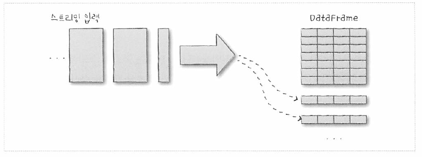
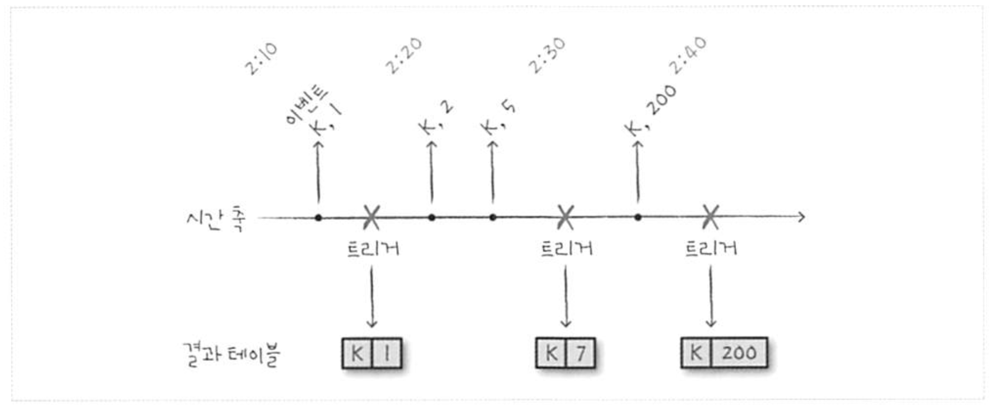

# 20. 스트림 처리의 기초
- 아파치 스파크는 스트림 처리에 필요한 고수준 기능을 지원중
	- 스파크 스트리밍, DStream API

## 20.1 스트림 처리란?
- 스트림 처리는 신규 데이터를 끊임없이 처리해 결과를 만들어내는 행위
	- 일련의 이벤트에 따라 일어난 입력 데이터 (예: 신용카드 전표 정보, 웹사이트 클릭, IoT 장비의 센서 데이터)
- 배치 처리는 한 번만 결과를 만들어내지만, 스트림은 계속해서 연산 작용을 수행
	- 스트림 입력 데이터를 주기적으로 배치 작업으로 조인하는 경우가 많음
- 연속형 어플리케이션 : 스트리밍, 배치, 대화형 작업으로 구성된 통합 어플리케이션
	- 구조적 스트리밍 = 레코드 단위 스트림 처리를 넘어 연속형 어플리케이션을 쉽게 구현함

### 20.1.1 스트림 처리 사례
#### 통보와 알림
- 연속적인 이벤트에서 특정 이벤트나 이벤트의 패턴을 탐지할 때 -> 알림
#### 실시간 리포트
- 실시간 대시보드를 만들기 위해 스트리밍 시스템 사용
#### 증분형 ETL
- 스트리밍을 통한 데이터 변환
#### 실시간 제공용 데이터 갱신
- 다른 어플리케이션에 사용될 데이터를 생성
- 증분 업데이트
#### 실시간 의사결정
- 신규 트랜잭션을 상태 정보와 자동 비교해서 부정행위 자동 판단 (ex. FDS)
#### 온라인 머신러닝
- 여러 사용자의 실시간 데이터를 조합하여 모델 학습
- 머신러닝 라이브러리를 활용하여 빠른 결과를 뱉어야하기 때문에 아주 도전적인 사례

### 20.1.2 스트림 처리의 장점
1. 대기 시간이 짧음
	- 분, 초, 밀리세컨드 단위로 빠르게 응답
2. 자동으로 연산 결과의 증분을 생성 -> 반복적인 배치 작업보다 결과를 수정할 때 효율적
	- 배치 작업의 경우 -> 전체 데이터를 연산
	- 스트리밍은 신규 데이터에 대해서만 갱신

### 20.1.3 스트림 처리의 과제
- ex. 차량의 센서 데이터 -> 특정 값이나 값의 패턴을 찾고자 함
	- ex. value action이 2, 10, 5 순서로 들어오는 경우 -> 어떤 액션 수행
		- 이벤트 간의 일부 상태를 유지해야 함
- 데이터 규모가 크거나 특정머신에 문제가 발생, 패턴을 계속해서 기억하고 있어야 함
- 문제점
	- 어플리케이션 타임스탬프 기준으로 순서가 뒤섞인 데이터 처리하기
	- 대규모의 상태 정보 유지하기
	- 높은 데이터 처리량 보장하기
	- 장애 상황에서도 정확히 한 번 처리하기
	- 부하 불균형과 뒤쳐진 서버 다루기
	- 이벤트에 빠르게 응답하기
	- 다른 저장소 시스템의 외부 데이터와 조인하기
	- 신규 이벤트 도착 시 출력 싱크의 갱신 방법 결정하기
	- 출력 시스템에 데이터 저장 시 트랜잭션 보장하기
	- 런타임에 비즈니스 로직 변경하기

## 20.2 스트림 처리의 핵심 설계 개념

### 20.2.1 레코드 단위 처리와 선언형 API
- 각 이벤트를 어플리케이션에 전달하고 사용자 코드에 반응하도록 설계
- 단점 : 
	- 사용자가 직접 상태를 추적해야 함
	- 메모리 확보를 위한 상태 제거와 중복 처리 방지 기능 구현
	- 정교한 개발이 어렵고 유지 보수하려면 높은 숙련도가 필요함
- 이에 선언형 API를 제공함
	- DStream API는 맵, 리듀스, 필터 같은 연산을 제공해줌

### 20.2.2 이벤트 시간과 처리 시간
- 이벤트 시간 처리는 원천 시스템에서 각 레코드에 기록한 타임스탬프를 기반으로 데이터를 처리하는 방식
	- 시스템에 늦게 도착한 이벤트를 처리할 수 있도록 상태 추적
	- 특정 윈도우 사이즈 (늦게 도착해도 데이터를 처리할 수 있는) 를 정의해야 함
- 하지만, 기본적으로 적용되어 있어서 자동으로 해결함
- 처리 시간 기준 처리는 스트리밍 어플리케이션에 레코드가 도착한 시간을 기반으로 처리

### 20.2.3 연속형 처리와 마이크로 배치 처리
- 연속형 처리 : 시스템을 구성하는 각 노드는 다른 노드에서 전송하는 메시지를 끊임없이 수신하고 새로 갱신된 정보를 자신의 하위노드에 전송, 노드 -> 노드 -> 노드
	- 각 노드가 신규 메시지에 즉각 반응하기 때문에 빠른 반응이 나타남
	- 하지만 레코드 단위 부하가 매우 커서 최대 처리량이 적음
		- 한번에 한 레코드만 처리함
		- 다음 노드를 부르려면 OS를 호출해야 하기 때문에 연산 부하가 발생함
- 마이크로 배치 : 
	- 입력 데이터를 작은 배치로 모음 (대기)
	- 다수의 분산 태스크로 배치를 병렬 처리
	- 더 적은 노드로 같은 양의 데이터를 처리할 수 있음
	- 워크로드 변화에 대응하여 태스크 수를 조절할 수 있는 부하 분산 기술을 동적으로 사용할 수 있음
	- 단점 : 
		- 작은 배치로 모으는 지연 시간이 발생함

- 지연 시간 요건과 총 운영 비용을 고려하여 두 가지 중 선택
	- 마이크로 배치 시스템 :
		- 초 단위의 응답 시간을 안정적으로 제공
		- 더 적은 노드로 동일한 처리량을 얻을 수 있어 운영비용을 낮출 수 있음
		- 장애도 덜 발생하게 됨 -> 운영비용 낮춤
	- 연속형 처리 시스템 :
		- 빠른 응답성을 제공해야 할 경우 사용

## 20.3 스파크의 스트리밍 API
### 20.3.1 DStream API
- 마이크로 배치 방식으로만 동작
- 제약 사항
	- 자바나 파이썬의 객체와 함수에 매우 의존적
	- 처리 시간을 기준으로 동작
		- 이벤트 시간 기준으로 처리하고 싶은 경우 자체 구현이 필요
	- 마이크로 배치 형태로만 동작
### 20.3.2 구조적 스트리밍
- 스파크의 구조적 API를 기반으로 하는 고수준 스트리밍 API
- 모든 환경에서 사용할 수 있음, 많은 종류의 최적화 기술을 자동으로 수행, 이벤트 시간 데이터 처리 지원, 연속형 처리 지원
- 스파크 스트리밍의 DStream API에 사용성과 성능을 더해 진화시킨 버전 -> 이 책에서 다룰 API

# 21. 구조적 스트리밍의 기초
## 21.1
- 스트리밍 처리용 코드, 목적지 정의 -> 신규 데이터 증분 및 연속형 쿼리 실행
-> 코드 생성 -> 쿼리 최적화 -> 논리적 명령 처리

- 스트림 데이터를 데이터가 계속해서 추가되는 테이블로 다룸
- 사용자의 쿼리를 어떻게 증분 처리할지 자동으로 파악
- SparkSQL를 통해 대화형으로 조회하는 테이블을 계속해서 갱신 가능함

## 21.2 핵심 개념
### 21.2.1 트랜스포메이션과 액션
- 트랜스포메이션 : 증분 처리할 수 없는 일부 쿼리 유형에 의한 제약사항이 있음
- 액션 : 스트림 처리를 시작한 뒤 연속적으로 처리하여 결과를 출력

### 21.2.2 입력 소스
- 아파치 카프카
- HDFS, S3 등 분산 파일 시스템의 파일
- 테스트용 소켓 소스

### 21.2.3 싱크
- 스트림의 결과를 저장할 목적지
- 출력용 싱크
	- 아파치 카프카
	- 거의 모든 파일 포맷
	- foreach 싱크
	- 테스트용 콘솔 싱크
	- 디버깅용 메모리 싱크

### 21.2.4 출력 모드
- 신규 정보만 추가하려는 경우 : append
- 바뀐 정보로 기존 로우를 갱신하는 경우 : update
- 매번 전체 결과를 덮어쓰려는 경우 : complete
- map 같은 경우에는 update와 어울림

### 21.2.5 트리거
- 데이터 출력 시점을 정의
- 언제 신규 데이터를 확인하고 결과를 갱신할지 정의
- 처리 시간 기반 트리거 지원

### 21.2.6 이벤트 시간 처리
- 이벤트 시간 기준 처리 지원

#### 이벤트 시간 데이터
- 이벤트 시간은 데이터에 기록된 시간 필드를 의미
- 데이터 생성 시간을 기준으로 처리
- 구조적 스트리밍은 데이터를 테이블로 표현하기 때문에 이벤트 시간은 테이블의 컬럼임
- 똑같이 표준 SQL를 이용하여 그룹화, 집계, 윈도우 처리 가능

#### 워터마크
- 시간 제한을 설정할 수 있는 스트리밍 시스템의 기능
- 늦게 들어온 이벤트를 어디까지 처리할지 시간을 제한할 수 있음
- 과거 데이터의 보관 주기를 제한하기 위해 워터마크를 사용함
- 워터마크는 특정 이벤트 시간의 윈도우 결과를 출력하는 시점을 제어

## 21.3 구조적 스트리밍 활용
- spark.readStream을 통해서 파일을 스트리밍으로 읽어올 수 있음
- spark action을 통해 데이터 write + 싱크 지정 (싱크는 메모리 싱크)
	- action명.writeStream.format("memory").outputMode("complete").start()
- awaitTermination() : 쿼리 종료 시까지 대기할 수 있도록 설정
	- 쿼리 실행 중 드라이버 프로세스가 종료되는 상황을 막음
- 실행 중인 스트림 목록은 spark.streams.active 로 목록 확인할 수 있음
- show를 실행하면 스트림 실행 중일 때 show 되므로 각각 다른 행을 출력함

## 21.4 스트림 트랜스포메이션

### 21.4.1 선택과 필터링

```python
from pyspark.sql.functions import expr
simpleTransform = streaming.withColumn("stairs", expr("gt like '%stairs%'"))\
  .where("stairs")\
  .where("gt is not null")\
  .select("gt", "model", "arrival_time", "creation_time")\
  .writeStream\
  .queryName("simple_transform")\
  .format("memory")\
  .outputMode("append")\
  .start()
```

- writeStream outputMode (append)로 가능

### 21.4.2 집계

```python
deviceModelStats = streaming.cube("gt", "model").avg()\
  .drop("avg(Arrival_time)")\
  .drop("avg(Creation_Time)")\
  .drop("avg(Index)")\
  .writeStream.queryName("device_counts").format("memory")\
  .outputMode("complete")\
  .start()
```

- cube, avg를 이용해서 집계도 가능

### 21.4.3 조인

```python
historicalAgg = static.groupBy("gt", "model").avg()
deviceModelStats = streaming.drop("Arrival_Time", "Creation_Time", "Index")\
  .cube("gt", "model").avg()\
  .join(historicalAgg, ["gt", "model"])\
  .writeStream.queryName("device_counts").format("memory")\
  .outputMode("complete")\
  .start()
```

- right join은 되지 않고, left join만 가능

## 21.5 입력과 출력

### 21.5.1 데이터를 읽고 쓰는 장소(소스와 싱크)

#### 파일 소스와 싱크

- 가장 간단한 소스 = 파일 소스
- 파케이, 텍스트, JSON, CSV 파일을 자주 사용
- 파일 소스를 이용하면 읽을 파일 수를 결정할 수 있음

#### 카프카 소스와 싱크

- 카프카는 분산형 버퍼
- 레코드의 스트림은 토픽으로 불리는 카테고리에 저장

### 21.5.2 카프카 소스에서 메시지 읽기

- assign

- subscribe

- subscribePattern

  (중략)

### 21.5.4 데이터 출력 방법(출력모드)

- append 모드
  - 기본 동작 방식, 새로운 로우가 결과 테이블에 추가되면 사용자가 명시한 트리거에 맞춰 싱크에 출력
- complete 모드
  - 결과 테이블의 전체 상태를 싱크로 출력
  - 데이터가 계속해서 변경될 때 좋음
- update 모드
  - 변경된 로우만 출력함

#### 적절한 출력 모드 선택하기

- 맵 연산은 complete 모드
- 집계 쿼리 
  - 워터마크와 이벤트 시간을 이용하는 집계
    - append
    - update
    - complete
  - 다른 집계
    - complete
    - update
- mapGroupsWithState 쿼리 : update
- flatMapGroupsWithState 쿼리 : append, update
- 기타 쿼리 : append, update

### 21.5.5 데이터 출력 시점(트리거)

- 데이터를 싱크로 출력하는 시점을 제어하려면 트리거를 설정해야 함

#### 처리 시간 기반 트리거

- 처리 주기를 문자열로 단순하게 지정 (5초를 주기로 트리거가 동작함)

```python
activityCounts.writeStream.trigger(processingTime='5 seconds')\
  .format("console").outputMode("complete").start()
```

#### 일회성 트리거

- 한 번에 처리할 수 있는 수준의 데이터로 애플리케이션을 테스트할 수 있음

```python
activityCounts.writeStream.trigger(once=True)\
  .format("console").outputMode("complete").start()
```

## 

# 22. 이벤트 시간과 상태 기반 처리
## 22.1 이벤트 시간 처리
- 이벤트가 실제로 발생한 시간 : 이벤트 시간
	- 데이터에 기록되어 있는 시간, 이벤트가 실제로 일어난 시간
- 이벤트가 시스템에 도착한 시간 또는 처리된 시간 : 처리 시간
	- 스트림 처리 시스템이 데이터를 실제로 수신한 시간
	- 데이터 위치에 따라서 버지니아에서 발생한 이벤트가 에콰도르에서 발생한 이벤트보다 먼저 데이터센터에 도착함
		- 이벤트가 같은 시간에 일어났다 하더라도 위치 때문에 항상 버지니아에서 발생한 이벤트가 먼저 처리됨
		- 네트워크 환경에 따라서 이벤트 전송이 느려질 수 있음
			- 처리 시간이 항상 이벤트 시간 기준으로 정렬되어 있다고 보장할 수 없음

## 22.2 상태 기반 처리
- 오랜 시간에 걸쳐 중간 처리 정보를 사용하거나 갱신하는 경우에만 필요
	- 이벤트 시간을 이용하거나 키에 대한 집계를 사용하는 상황에서 일어남
	- 상태 저장소에 상태를 저장해야 함

## 22.3 임의적인 상태 기반 처리
- 상태의 유형, 갱신 방법, 제거 시점에 따라 제어가 필요할 수 있음
	- 이에 따른 처리를 임의적인 상태 기반 처리라고 부름
- 예시
	- 전자 상거래 사이트에서 사용자 세션 정보를 기록하여 다음 세션에 실시간 추천 서비스를 제공할 때
	- 웹 어플리케이션에서 사용자 세션별로 오류가 5번 발생했을 때 오류 보고 -> 카운트 기반 윈도우
	- 중복 이벤트를 계속해서 제거해야 할 때, -> 과거의 모든 레코드를 추적

## 22.4 이벤트 시간 처리의 기본
```python
spark.conf.set("spark.sql.shuffle.partitions", 5)
static = spark.read.json("/data/activity-data")
streaming = spark\
  .readStream\
  .schema(static.schema)\
  .option("maxFilesPerTrigger", 10)\
  .json("/data/activity-data")
```
- Creation_time : 이벤트가 생성된 시간
- Arrival_time : 서버에 도착한 시간

## 22.5 이벤트 시간 윈도우
- 타임스탬프 컬럼을 적절한 스파크 SQL 타임스탬프 데이터 타입으로 변환
```python
withEventTime = streaming.selectExpr(
  "*",
  "cast(cast(Creation_Time as double)/1000000000 as timestamp) as event_time")
```

### 22.5.1 텀블링 윈도우
- 주어진 윈도우에서 이벤트가 발생한 횟수를 카운트하는 연산
	- 트리거가 실행될 때마다 마지막 트리거 이후에 수신한 데이터를 처리해 결과 테이블 갱신

```python
from pyspark.sql.functions import window, col
withEventTime.groupBy(window(col("event_time"), "10 minutes")).count()\
  .writeStream\
  .queryName("pyevents_per_window")\
  .format("memory")\
  .outputMode("complete")\
  .start()
```
- 10분 간격으로 발생한 이벤트 count를 집계

#### 슬라이딩 윈도우

- 윈도우를 윈도우 시작 시각에서 분리하는 방법
```python
from pyspark.sql.functions import window, col
withEventTime.groupBy(window(col("event_time"), "10 minutes"), col("User")).count()\
  .writeStream\
  .queryName("pyevents_per_window")\
  .format("memory")\
  .outputMode("complete")\
  .start()
```
- 5분마다 시작하는 10분짜리 윈도우

### 22.5.2 워터마크로 지연 데이터 제어하기
- 데이터가 필요 없어지는 시간을 지정 
- 스트림에서 오래된 데이터를 제거하는 데 필요한 워터마크를 반드시 지정하여야 시스템이 긴 시간 동안 부하에 노출되지 않음
- 워터마크 : 특정 시간 이후에 처리에서 제외할 이벤트나 이벤트 집합에 대한 시간 기준
- 지연 도착 현상 : 네트워크 지연이나 장비의 연결 실패 등으로 발생
- 남미에 사는 고객이 만들어낸 이벤트에 약간의 지연이 발생 -> 워터마크 10분 지정
	- 이전 이벤트보다 10분 전에 일어난 모든 이벤트를 무시한다. -> 10분 이내의 이벤트만 받아들임
```python
from pyspark.sql.functions import window, col
withEventTime\
  .withWatermark("event_time", "30 minutes")\
  .groupBy(window(col("event_time"), "10 minutes", "5 minutes"))\
  .count()\
  .writeStream\
  .queryName("pyevents_per_window")\
  .format("memory")\
  .outputMode("complete")\
  .start()
```
- 5분 간격으로 시작하는 10분 단위 윈도우가 30분까지 지연되면 pass

## 22.6 스트림에서 중복 데이터 제거하기
- 중복 제거는 레코드 단위 처리 시스템에서 가장 처리하기 어려운 연산
- 한 번에 많은 레코드를 처리해야 하므로 중복 제거는 처리 시스템에 큰 부하를 발생
```python
from pyspark.sql.functions import expr

withEventTime\
  .withWatermark("event_time", "5 seconds")\
  .dropDuplicates(["User", "event_time"])\
  .groupBy("User")\
  .count()\
  .writeStream\
  .queryName("pydeduplicated")\
  .format("memory")\
  .outputMode("complete")\
  .start()

```
- user와 event_time 기준으로 중복 제거

## 22.7 임의적인 상태 기반 처리
- 특정 키의 개수를 기반으로 윈도우 생성하기
- 특정 시간 범위 안에 일정 개수 이상의 이벤트가 있는 경우 알림 발생시키기
- 결정되지 않은 시간 동안 사용자 세션을 유지하고 향후 분석을 위해 세션 저장하기

- 데이터의 각 그룹에 맵 연산을 수행하고 각 그룹에서 최대 한 개의 로우를 만들어냄 -> mapGroupsWithState API
- 데이터의 각 그룹에 맵 연산을 수행하고 각 그룹에서 하나 이상의 로우를 만들어냄 -> flatMapGroupsWithState API

### 22.7.1 타임아웃
- 타임아웃은 중간 상태를 제거하기 전에 기다려야 하는 시간을 정의
- 주기를 설정하여 시간이 설정한 주기만큼 흐르면 타임아웃이 발생
- 타임아웃을 사용하더라도 워터마크를 반드시 지정해야 함

### 22.7.2 출력 모드
- mapGroupsWithSate = update mode
- flatMapGroupsWithState = append, update mode

# 23. 운영 환경에서의 구조적 스트리밍
## 23.1 내고장성과 체크포인팅
- 스파크 엔진이 자동으로 관리하는 체크포인트와 WAL를 사용하도록 설정해야 함
	- 체크포인트 경로를 쿼리로 설정해놓아야 함
```python
static = spark.read.json("/data/activity-data")
streaming = spark\
  .readStream\
  .schema(static.schema)\
  .option("maxFilesPerTrigger", 10)\
  .json("/data/activity-data")\
  .groupBy("gt")\
  .count()
query = streaming\
  .writeStream\
  .outputMode("complete")\
  .option("checkpointLocation", "/some/python/location/")\
  .queryName("test_python_stream")\
  .format("memory")\
  .start()
```

## 23.2 어플리케이션 변경하기
- 체크포인팅은 현재까지 처리한 스트림과 모든 중간 상태를 저장함
- 어플리케이션을 업데이트 할 때, 이전 체크포인트 데이터를 고려해야 함

### 23.2.1 스트리밍 어플리케이션 코드 업데이트 하기
- 사용자 정의 함수는 시그니처가 같은 경우에만 코드를 변경할 수 있음
- 새로운 체크포인트 디렉터리를 사용하는 중대한 변화가 생길 경우, 반드시 비어 있는 신규 체크 포인트 디렉터리를 지정하고 처음부터 다시 처리

### 23.2.2 스파크 버전 업데이트하기
- 릴리스 노트를 확인해 스파크 버전을 업그레이드할 때 호환성이 보장되는지 확인
- 스파크의 패치 버전 업데이트에 상관없이 이전 체크포인트 디렉토리를 사용해 재시작할 수 있음

### 23.2.3 어플리케이션의 초기 규모 산정과 재조정하기
- 클러스터는 데이터가 급증하는 상황에서도 안정적으로 처리할 수 있는 크기를 가져야 함
- 유입률이 처리율보다 훨씬 크다면 크기를 늘리거나 어플리케이션의 익스큐터를 동적으로 추가해야 함
- 재시작하는 방식으로 어플리케이션의 크기를 줄일 수 있음

## 23.3 메트릭과 모니터링
### 23.3.1 쿼리 상태
- query.status : 스트림의 현재 상태를 반환

### 23.3.2 최근 진행 상황
- query.recentProgress : 쿼리 진행 상황을 확인

#### 유입률과 처리율
- 유입률 : 입력 소스에서 구조적 스트리밍 내부로 데이터가 유입되는 양
- 처리율 : 유입된 데이터를 처리하는 속도
- 유입률이 처리율보다 훨씬 큰 경우, 클러스터의 규모를 늘려 더 많은 데이터를 처리해야 함

#### 배치 주기
- 적정한 처리량을 얻기 위한 배치 주기를 설정

### 23.3.3 스파크 UI
- 구조적 스트리밍과 관련된 잡, 태스크 그리고 처리 메트릭을 확인할 수 있음

## 23.4 알림
- 잠재적인 문제를 발견하기 위하여 잡이 실패하거나 유입률보다 처리율이 떨어지는 경우 자동으로 알려주는 기능 필요
- 쿼리 모니터링 및 클러스터와 전체 어플리케이션의 상태를 모니터링해야 함

## 23.5 스트리밍 리스너를 사용한 고급 모니터링
- StreamingQueryListener 클래스를 이용해 비동기 방식으로 스트리밍 쿼리 정보를 수신
	- 다른 시스템에 자동으로 해당 정보를 전송하여 모니터링 및 알림 매커니즘 구현 가능

