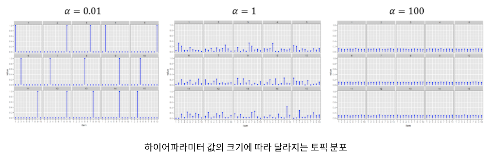

# 비지도 학습
- 비지도 학습 중 군집화에 대해 자세히 설명
- 군집화는 차원의 저주에 쉽게 빠짐
	- 차원의 저주 : 특징 공간의 차원이 증가하면 밀도가 점점 희소해지는 현상
	- 차원이 높을수록 데이터에 많은 노이즈가 발생하고, sparse 데이터가 많아짐
- 비지도 학습은 주어진 데이터셋의 근본적인 구조적 특징을 간결하게 표현해야 함

## 29.1 활용 사례
- 데이터 이상치 탐지
	- 다수의 값이 하나의 큰 그룹으로 군집화
	- 몇몇 소그룹으로 군집화되는 경우 -> 해당 소그룹에 대해 추가 조사
- 토픽 모델링
	- 텍스트 문서 사이의 공통적인 주제를 도출

## 29.2 모델 확장성
- 최대 연산 한계
	- k-평균 : 특징 수 X 군집 수 < 1천만건
	- 이분법 k-평균 : 특징 수 X 군집 수 < 1천만건
	- GMM : 특징 수 X 군집 수 < 1천만건
	- LDA : 최대 1,000개 토픽

## 29.3 k-평균
- 가장 많이 사용하는 군집화 알고리즘
1. 지정한 군집 수 k에 대해서 데이터셋 내 서로 다른 포인트에 무작위로 할당함
2. 할당되지 않은 포인트들은 직전에 할당된 포인트와의 유클리드 거리를 계산하여 가장 가까이에 위치한 군집으로 할당
3. 할당된 이후, 각 군집의 중심(센트로이드)를 계산하고, 다시 그 센트로이드로부터 가장 가까이에 위치한 포인트를 할당
4. 1번~3번 과정을 지정한 횟수만큼 반복하거나 중심값이 변경되지 않을 때까지 반복
- 항상 적절한 결과가 도출되지 않으므로, 서로 다른 초깃값으로 여러 번 수행해봐야 함
- 적절한 k 값을 선택하는 것도 매우 중요하고 어려움
	- 엘보우 기법 : k 수를 늘리면서 try할 때, 클러스터 내 오차제곱합의 값이 더이상 큰 폭으로 감소되지 않는 지점 (팔꿈치 부분)
### 29.3.1 모델 하이퍼파라미터
- k : 최종 생성하고자 하는 군집 수

### 29.3.2 학습 파라미터
- initMode : 군집 중심의 시작 위치를 결정하는 알고리즘
	- 옵션 : random, k-means||
- initSteps : 초기화 모드의 단계 수, 기본값은 2이고 0보다 커야 함
- maxIter : 군집화를 수행할 총 반복 횟수
- tol : 모델의 최적화 임곗값
- maxIter를 높일수록 시간이 오래 걸림

### 29.3.3 실습 예제
```python

from pyspark.ml.clustering import KMeans
km = KMeans().setK(5)
print km.explainParams()
kmModel = km.fit(sales)

```

### 29.3.4 k-평균 평가지표 요약 정보
- summary : 군집화 사이즈를 알 수 있으며, 공통적인 척도를 제공함
- computeCost : 군집내 오차제곱합을 계산할 수 있음
- k-평균의 목표는 사요자가 지정한 군집 수 k에 따라 군집내 오차제곱합을 최소화하는 것

## 29.4 이분법 k-평균 (Bisecting k-평균)
- k-평균은 초기 데이터에 여러 그룹을 할당하면서 bottom-up 군집화를 진행하지만 , 이분법 k-평균은 top-down 방식으로 군집화함
- 최초에 단일 그룹을 생성 -> 작은 그룹으로 나누고 k 수만큼 군집화를 끝냄

### 29.4.1 모델 하이퍼파라미터
- k : 최종 생성하고자 하는 군집 수

### 29.4.2 학습 파라미터
- minDivisibleClusterSize : 군집으로 분류하기 위해 포함되어야 할 최소 데이터 수 또는 비율
- maxIter : 군집화를 수행할 총 반복 횟수

### 29.4.3 실습 예제
```python
from pyspark.ml.clustering import BisectingKMeans
bkm = BisectingKMeans().setK(5).setMaxIter(5)
bkmModel = bkm.fit(sales)
```

### 29.4.4 이분법 k-평균 요약 정보
- k-평균과 동일한 내용

## 29.5 가우시안 혼합 모델
- 각 군집이 가우시안 분포로부터 무작위 추출을 하여 데이터를 생성한다고 가정
- 생성된 군집 가장자리에는 데이터가 포함될 확률이 낮아야 하며, 군집 중앙에는 데이터가 포함될 확률이 훨씬 높아야 한다.
- 자체적인 평균 및 표준편차를 보유한 임의의 크기로 배정됨
- 여러 개의 가우시안 분포로 데이터를 표현

### 29.5.1 모델 하이퍼파라미터
- k : 최종 생성하고자 하는 군집 수

### 29.5.2 학습 파라미터
- maxIter : 군집화를 수행할 총 반복 횟수
- tol : 모델 최적화 임곗값

### 29.5.3 실습 예제
```python
from pyspark.ml.clustering import GaussianMixture
gmm = GaussianMixture().setK(5)
print gmm.explainParams()
model = gmm.fit(sales)
```

### 29.5.4 가우시안 혼합 모델 요약 정보
- 생성된 클러스터의 정보, 가중치, 평균 및 가우스 혼합의 공분산이 포함되어 있음

## 29.6 잠재 디리클레 할당 (LDA)
- 텍스트 문서에 대한 토픽 모델링을 수행하는 데 사용되는 계층적 군집화 모델
- spark에서 온라인 LDA와 기댓값 최대화 (expectation maximixation)
	- 온라인 LDA는 샘플 데이터가 많을 경우, 기댓값 최대화는 어휘 수가 많은 경우에 적합
- [URL](http://bigdata.emforce.co.kr/index.php/2020072401/)

### 29.6.1 모델 하이퍼파라미터
- k : 입력된 데이터로부터 최종적으로 추론할 총 주제 수
- docConcentration : = alpha, 문서가 가지는 주제 분포의 사전 추정치
	- 디리클레 분포 파라미터
	- 이 값이 클수록 편평화 (일반화) 된다는 의미
	- 문서들의 토픽 분포를 얼마나 밀집되게 할 것인지 
	- 
- topicConcentration : = beta, 주제가 가지는 단어 분포의 사전 추정치
	- 문서내 단어들의 토픽 분포를 얼마나 밀집되게 할 것인지

### 29.6.2 학습 파라미터
- maxIter : LDA를 수행할 총 반복 횟수
- optimizer : LDA 모델을 학습시킬 알고리즘, EM 또는 온라인 학습 최적화
- learningDecay : 지수적 감쇠율
- learningOffset : 초기 반복 수행 횟수
- optimizeDocConcentration : docConcentration이 최적화될지 여부
- subsamplingRate : 각 반복 수행에서 말뭉치 샘플링의 비율
- seed : Random Seed
- checkpointInterval : 체크포인트 기능

### 29.6.3 예측 파라미터
- topicDistributionCol : 각 문서의 주제 혼합 분포의 결과

### 29.6.4 실습 예제
```python
from pyspark.ml.feature import Tokenizer, CountVectorizer
tkn = Tokenizer().setInputCol("Description").setOutputCol("DescOut")
tokenized = tkn.transform(sales.drop("features"))
cv = CountVectorizer()\
  .setInputCol("DescOut")\
  .setOutputCol("features")\
  .setVocabSize(500)\
  .setMinTF(0)\
  .setMinDF(0)\
  .setBinary(True)
cvFitted = cv.fit(tokenized)
prepped = cvFitted.transform(tokenized)

from pyspark.ml.clustering import LDA
lda = LDA().setK(10).setMaxIter(5)
print lda.explainParams()
model = lda.fit(prepped)

model.describeTopics(3).show()
cvFitted.vocabulary
```
- 로그 우도 및 복잡도 (perplexity)를 도출할 수 있음


